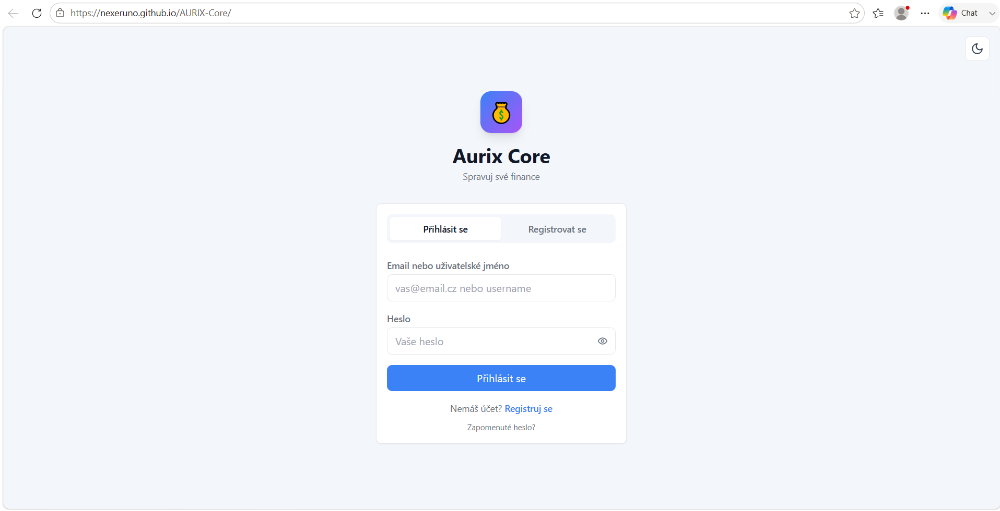
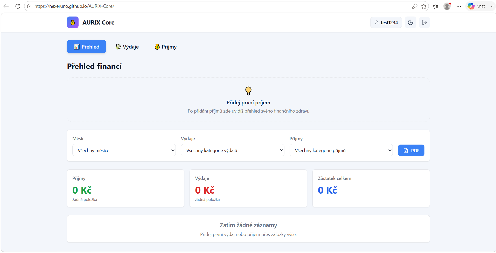
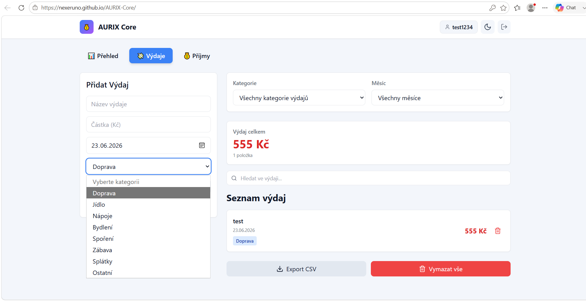
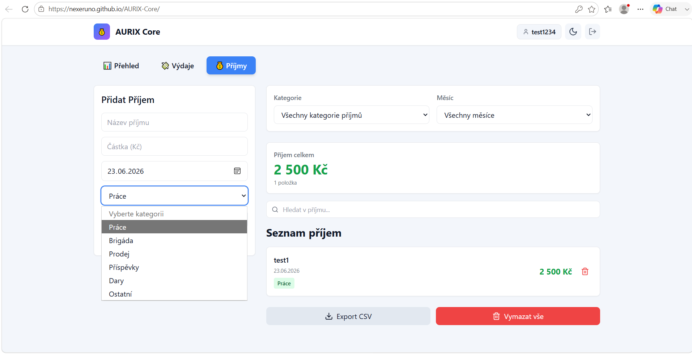
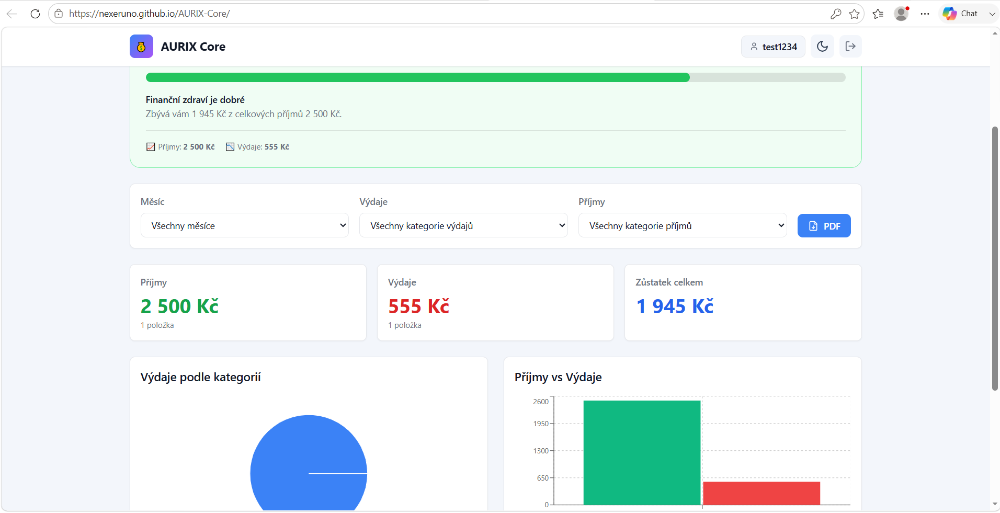
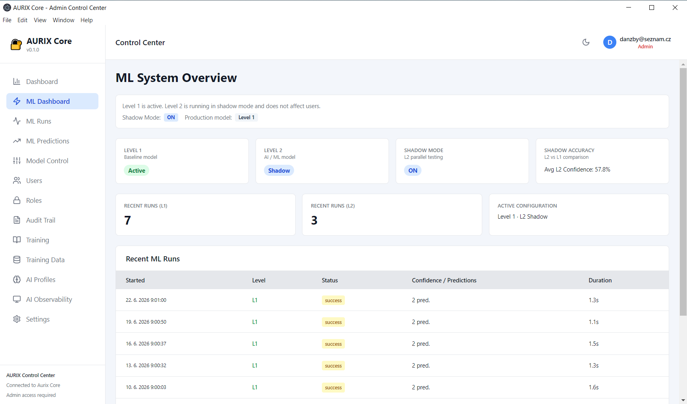
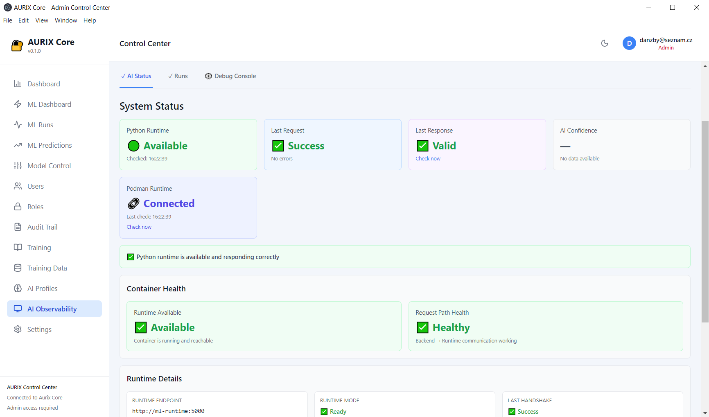

# AURIX Core

Portfolio full-stack prototyp zaměřený na osobní finance, administraci a ML runtime vrstvu.

Projekt je postavený jako learning project, na kterém jsem testoval návrh architektury, propojování frontend/backend služeb, Firebase, observabilitu, kontejnerizaci a CI/CD.

---

## Co je AURIX Core

AURIX Core je portfolio prototyp s více částmi:

- Finance Web App (React/Vite) pro evidenci příjmů a výdajů
- Electron admin aplikace pro role, audit a ML dohled
- Node.js backend proxy mezi desktop aplikací a ML runtime
- Python ML runtime (Flask) s endpointy pro health/readiness/predict/validaci datasetů
- Integrace s Firebase Authentication a Firestore

Cílem nebylo dodat hotový komerční produkt, ale ukázat schopnost navrhnout a propojit celé end-to-end řešení.

---

## Status projektu

Tento repozitář je portfolio full-stack prototyp, ne hotová produkční aplikace.

Aktuálně funkční části:

- Webová část běží na GitHub Pages
- Lokálně lze spustit Electron + backend + ML runtime
- Funguje CI/CD pipeline (lint, test, build, deploy)
- Je připravena observabilita a základní ML workflow

Co zatím není production-ready:

- ML část je z části simulovaná (nejde o finálně natrénovaný produkční model)
- Chybí distribuční balíček Electron aplikace pro koncové uživatele
- Cloud provoz backendu/runtime je připravený jen na úrovni infra podkladů

---

## Screenshoty (portfolio ukázka)

### 1) Login



### 2) Přehled



### 3) Výdaje



### 4) Příjmy



### 5) Vyplněný přehled



### 6) AURIX Core ML dashboard



### 7) AI Observability



---

## Jak projekt spustit

### Rychlý start (Windows)

```powershell
.\scripts\startup\start-aurix-core.bat
```

Skript automaticky:

1. ověří Node.js a Podman
2. spustí Podman machine
3. postaví a spustí `ml-runtime` a `node-backend`
4. počká na health check
5. spustí Electron aplikaci

### Manuální start (bez Podman)

```powershell
# Terminal 1 - ML runtime
python ml-runtime/app.py

# Terminal 2 - Node backend
cd backend
npm install
npm start

# Terminal 3 - Electron app
cd desktop-app
npm install
npm run electron-dev
```

### Důležité k veřejnému spuštění

Bez vlastní konfigurace není projekt plně spustitelný v "public" režimu.

Důvod:

- je nutné doplnit vlastní Firebase projekt a `.env` hodnoty
- část integrací počítá s lokální konfigurací služeb a tajných údajů
- bez vlastních credentials nebude autentizace/datová vrstva fungovat korektně

Základní konfigurace:

```powershell
Copy-Item .env.example .env.local
Copy-Item .env.docker-compose.example .env.docker-compose
```

---

## Co jsem se na projektu naučil

- Praktický debugging komplexních toků mezi frontendem, backendem a Python runtime
- Návrh rozhraní mezi službami (kontrakty, health/readiness, error handling)
- Integraci Firebase Authentication + Firestore v reálné aplikaci
- Práci s chybovými stavy, observabilitou a logováním
- Kontejnerizaci (Docker/Podman), lokální orchestraci a startup skripty
- Nastavení CI/CD pipeline od lintu po deploy
- Efektivní práci s AI asistentem při vývoji, refaktoringu a dokumentaci

---

## Tech stack

- Frontend: React 18, Vite, Tailwind CSS
- Desktop: Electron, React, TypeScript
- Backend: Node.js, Express
- ML runtime: Python 3.11, Flask
- Data/Auth: Firebase Auth, Firestore
- DevOps: Podman, Docker Compose, GitHub Actions

---

## Struktura repozitáře (zkráceně)

- `src/` - webová aplikace (finance)
- `desktop-app/` - Electron admin aplikace
- `backend/` - Node.js proxy API
- `ml-runtime/` - Python ML runtime
- `functions/` - Firebase Cloud Functions
- `scripts/startup/` - startup skripty (`.bat`, `.ps1`)
- `k8s/` - Kubernetes manifesty

---

## Pro HR

Tento projekt slouží jako důkaz schopnosti samostatně navrhnout a dotáhnout složitější full-stack řešení.

Ukazuje:

- analytické myšlení a návrh architektury
- schopnost implementace napříč technologiemi
- práci s reálnými omezeními (konfigurace, chyby, nasazení)
- orientaci na kvalitu (testy, lint, CI/CD, observabilita)

Autor: Daniel Řezáč
